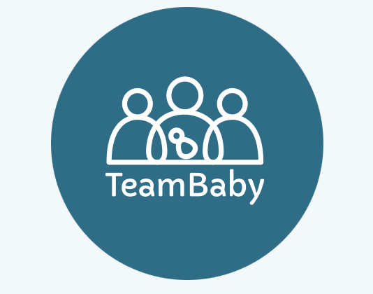

# Efficacy of TeamBaby web-app

This repository presents the code used for the publication "eHealth for safe communication when giving birth: A mixed method study with pregnant women and mothers" by:  
  
  - Sonia Lippke. 
  - Martina Schmiedhofer. 
  - Beate Hüner. 
  - Vinayak Anand-Kumar. 
  - Margrit Schreier
  - Christina Derksen

## Executing the code

All scripts used to test and develop the final set of models are included in the folder "R".  

Please follow the steps below to re-produce the results/ gain insights into how the models were developed:  
  
  1) Please contact the lead author and request permission to get a copy of the dataset. 
  2) Place the dataset in a newly created folder within the project called "input". 
  3) Open "R/99_run_script.R". 
  4) Run lines of code under the comment heading "prep-data". 
  5) Run lines of code under the comment heading "imputation". 
  6) Run lines of code under the comment heading "analyse-data". 
  7) Run lines of code under the comment heading "visualise-data". 

This program of work was carried out as part of the TeamBaby project and the Health CASCADE network.

  